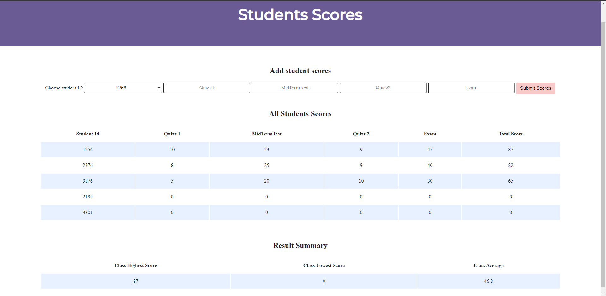
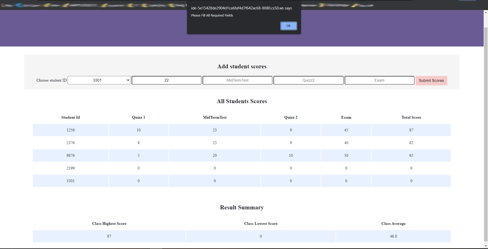

# INTERN Project-1

The project is a webpage for 5 students with the following registration numbers: 1256, 9876, 2376, 2199, 3301. To collect their scores (Quizz1, MidTermTest, Quizz2, Exam) and compute their total score for the term.

### The program should accomplish the following:
1. Display all scores for each student
2. Give each student a position based on their total score
3. Displaying the entire results according to position
4. Displaying result summary with the following: class highest score, lowest score, class average. 

Technologies used:

- Python/Flask.
- JS.
- HTML.
- CSS.

## How the webpage works?

The idea is simple. The user select the student ID. During that you need to enter these fields:

- Quizz 1
- MidTerm Test
- Quizz 2
- Exam
All fields are required to be filled in, and must not be empty.

## Pictures
- The program running in a Web browser

- An alert pops up when some of the fields are empty

## Possible improvements

As all applications this one can also be improved. Possible improvements:

- Have registereing page, so we could add more student.
